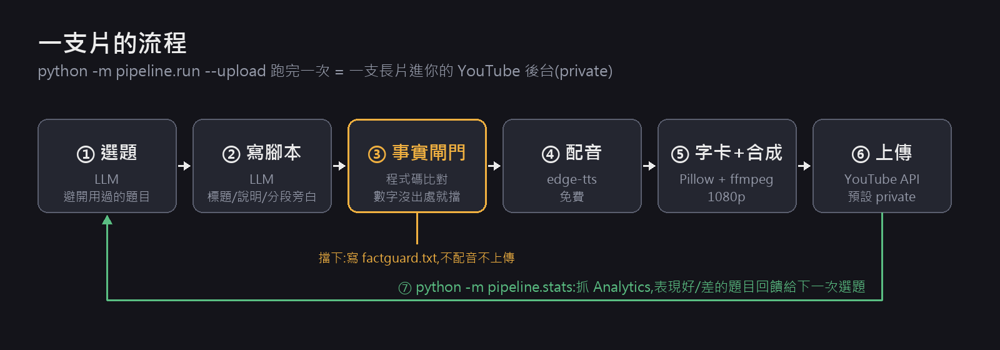
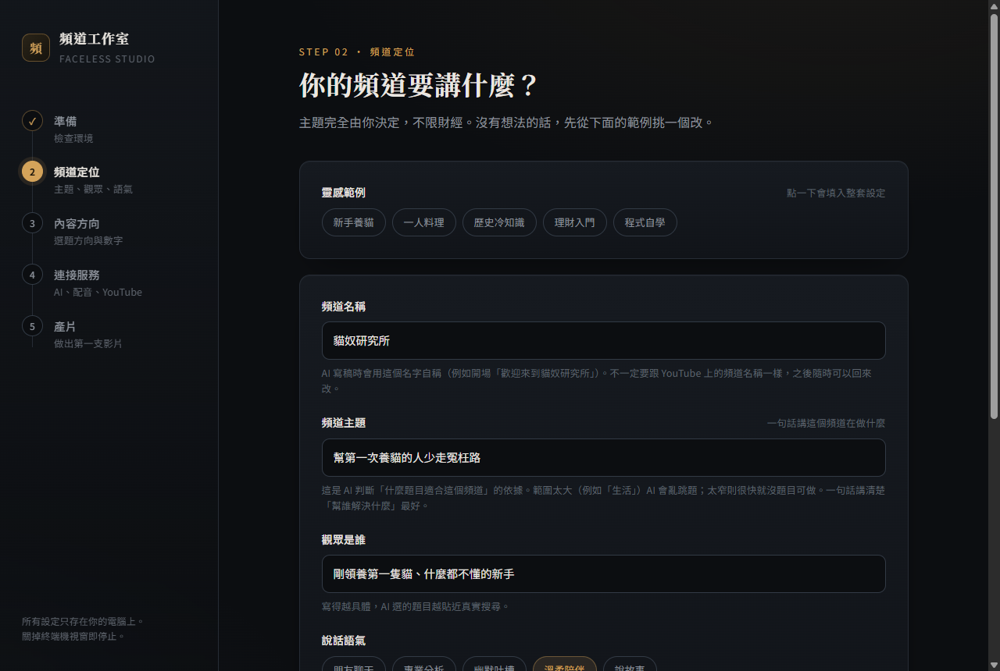
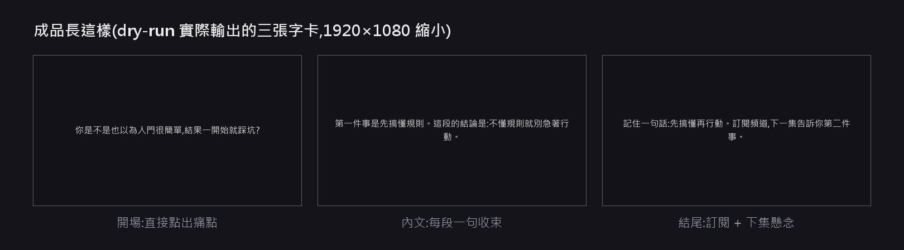

# youtube-autopilot-playbook

**頻道主題由你自己決定(養貓、料理、歷史、理財都行)。每跑一次就產出一支有旁白、有字卡的 YouTube 長片或 Shorts,自動上傳到你的頻道後台(private),再依觀看數據調整下一次選題。不會寫程式也能用:雙擊一個檔案,在瀏覽器裡一步步設定。**

[](https://www.youtube.com/@CarsonQuant)


這是 [量化阿森](https://www.youtube.com/@CarsonQuant) 頻道實際在用的做法,拿掉頻道專屬的部分後整理成通用版。repo 分兩部分:

- **可以直接跑的精簡產線**(`pipeline/`):一條指令從選題做到上傳。
- **方法手冊**([`PLAYBOOK.md`](PLAYBOOK.md)):實際經營時踩過的坑,只寫做法,不放頻道內部數字。



---

## 目錄

- [最快上手:雙擊就開始](#最快上手雙擊就開始)(不用打指令)
- [成品長這樣](#成品長這樣)
- [需要準備什麼](#需要準備什麼)
- [使用教學(命令列版)](#使用教學命令列版)(8 個步驟,從安裝到自動回饋選題)
- [事實閘門擋下時怎麼辦](#事實閘門擋下時怎麼辦)
- [每天自動跑](#每天自動跑)
- [常見問題](#常見問題)
- [專案結構](#專案結構)
- [安全與合規](#安全與合規)
- [方法手冊導讀](#方法手冊導讀)

---

## 最快上手:雙擊就開始

不會寫程式也沒關係,整個設定都在瀏覽器裡完成:

1. 裝好 [Python 3.9 以上](https://www.python.org/downloads/)。Windows 安裝時記得勾選 **Add python.exe to PATH**。
2. 在這個頁面按綠色的 **Code → Download ZIP**,下載後解壓縮。
3. 打開資料夾,雙擊 **`start.bat`**(Windows)或 **`start.command`**(macOS)。第一次會花一兩分鐘自動安裝需要的套件,接著瀏覽器會自動打開設定精靈。
   - macOS 如果跳出「無法打開」之類的安全警告:先按「完成」關掉,到「系統設定 → 隱私權與安全性」,捲到最下面,在提到 `start.command` 的那一行按打開(英文介面是 **Open Anyway**)。舊版 macOS 也可以直接對檔案按右鍵 → 打開。
   - 如果雙擊後打開的是文字編輯器,或上面的方法都不行:打開「終端機」,輸入 `bash `(後面留一個空白),把 `start.command` 拖進視窗,按 Enter。



精靈總共 5 步,每一步都附說明,要申請的東西也有一步一步的教學:

| 步驟 | 做什麼 |
|---|---|
| 1. 準備 | 檢查電腦環境(缺 ffmpeg 會告訴你怎麼裝),說明各功能要準備什麼、要不要錢 |
| 2. 頻道定位 | 頻道名稱、主題、觀眾、語氣。可以從範例(養貓、料理、歷史…)一鍵套用再修改 |
| 3. 內容方向 | 給 AI 幾個選題方向、長片長度、允許引用的數字 |
| 4. 連接服務 | 貼上 OpenRouter 金鑰並一鍵測試;從清單挑 AI 模型,旁邊直接標出每支片大約多少錢;要自動上傳的話,照著教學設定 Google |
| 5. 產片 | 先「試跑」(免費、不用金鑰),再正式產片或產片並上傳 |

所有設定只存在你自己的電腦上。精靈只開在本機(`127.0.0.1`),同一個網路裡的其他人連不進來。關掉那個黑色的終端機視窗,精靈就停止。

想用指令操作、排程每天自動跑,看下面的[使用教學(命令列版)](#使用教學命令列版)。

---

## 成品長這樣



每段旁白配一張深色字卡,配音由 edge-tts 產生,最後用 ffmpeg 接成一支 1920×1080 的 mp4。

> 這是**骨架**,畫面刻意做得很陽春。它負責把「選題 → 腳本 → 查數字 → 配音 → 合成 → 上傳 → 看數據」整條串起來,讓你先有一條會動的產線;畫面要做成什麼樣子,換掉 `pipeline/render.py` 就好。

---

## 需要準備什麼

| 項目 | 用途 | 要花錢嗎 |
|------|------|----------|
| Python 3.9 以上 | 執行產線 | 免費 |
| [ffmpeg](https://ffmpeg.org/download.html) | 把字卡和配音合成影片 | 免費 |
| 中文字型 | 畫字卡。Windows(微軟正黑體)、macOS(蘋方)、Linux(Noto Sans CJK)會自動找;找不到時在 `.env` 設 `FONT_FILE` | 免費 |
| [OpenRouter](https://openrouter.ai/) API key | 讓 LLM 選題、寫腳本 | **要**,依你選的模型按用量計費 |
| Google Cloud 專案 | 上傳 YouTube、讀 Analytics(只有要上傳時才需要) | 免費(有每日配額) |

配音用 edge-tts(微軟 Edge 的線上語音),不用 API key。

用設定精靈的話,這些東西去哪裡申請、怎麼申請,精靈裡都有一步一步的教學。

---

## 使用教學(命令列版)

設定精靈做的事和這裡一樣,只是改成用表單填。兩種方式的設定檔是共用的,可以混著用。

### 步驟 1:安裝

```bash
git clone https://github.com/carsonchou/youtube-autopilot-playbook.git
cd youtube-autopilot-playbook
pip install -r requirements.txt
ffmpeg -version   # 有印出版本號就代表 ffmpeg 裝好了
```

### 步驟 2:用假資料試跑一次(不花錢、不連網)

```bash
python -m pipeline.run --dry-run
```

`--dry-run` 會用內建的假腳本和假配音(靜音)跑完整條產線,**不會呼叫任何外部服務**。跑完會看到:

```
影片:output/20260923-215634/video.mp4
```

打開那支 mp4,看到三張字卡就代表 ffmpeg、字型和產線串接都裝對了。

> dry-run 只驗得到本機環境。API key 對不對、網路通不通,要到步驟 5 才知道。

### 步驟 3:設定你的題材

```bash
cp niche.example.yaml niche.yaml
```

打開 `niche.yaml` 改成你的題材。主題完全由你決定,範例只是示意。`channel_name`、`theme`、`audience`、`tone`、`minutes` 和 facts 的 `subject`/`value` 會寫進給 LLM 的腳本指示;`seed_topics` 用在選題;`playlist_id` 和 facts 的 `source` 不給 LLM(`source` 是給你自己查證用的):

```yaml
channel_name: "我的頻道"
theme: "幫新手避開常見的坑"                    # 一句話講這個頻道在做什麼,選題和寫腳本都會參考
audience: "剛開始接觸這個領域、怕被坑的新手"   # 寫得越具體,腳本越對味
tone: "像朋友聊天,白話,不賣弄術語"
minutes: 8                                     # 目標片長(分鐘)
playlist_id: ""                                # 上傳後要加進的播放清單 ID,留空就不加
seed_topics:                                   # 種子主題,LLM 會從這裡延伸選題
  - "新手最常犯的錯"
  - "某個常見說法到底對不對"
facts:                                         # ⚠️ 腳本裡「允許出現」的數字
  - subject: "範例主體"
    value: "12.5%"
    source: "https://example.com/請填資料來源"
```

**`facts` 是最重要的欄位。** 腳本裡每一個阿拉伯數字都要在這裡找得到出處,而且要和它的主體(`subject`)出現在同一句,不然整支片會被擋下(見[事實閘門擋下時怎麼辦](#事實閘門擋下時怎麼辦))。題材不需要數字的話(例如養貓、料理),`facts` 直接留空:這時 LLM 會被要求全文不寫數字,萬一還是寫了,整支片一樣會被擋下。

### 步驟 4:填 API key

```bash
cp .env.example .env
```

打開 `.env`,填這兩行:

```ini
OPENROUTER_API_KEY=sk-or-...        # 到 https://openrouter.ai/keys 建立
LLM_MODEL=                          # 到 https://openrouter.ai/models 挑一個模型,填它的 id
```

其他欄位可以先不動:`TTS_VOICE` 預設是台灣女聲 `zh-TW-HsiaoChenNeural`,其他聲音可以用 `edge-tts --list-voices` 查。`.env` 已經被 `.gitignore` 排除,不會被 commit。

### 步驟 5:產出第一支片(先不上傳)

```bash
python -m pipeline.run
```

每跑一次會在 `output/` 下開一個新的時間戳資料夾:

```
output/
├── topics_used.json          # 用過的題目,下次選題會避開
└── 20260923-220102/
    ├── script.json           # 標題、說明欄、分段旁白 ← 先讀這個
    ├── card00.png ...        # 每段一張字卡(card00 會拿來當縮圖)
    ├── seg00.mp3 ...         # 每段配音
    └── video.mp4             # 成品
```

**發布前一定要把 `script.json` 和影片從頭到尾看過一遍。** 事實閘門只會檢查數字,內容說得對不對,它判斷不了。

#### 指定題目、改做短片

預設是 LLM 從 `seed_topics` 挑題目、產橫式長片。兩個選項可以改掉,也可以一起用:

| 選項 | 效果 |
|---|---|
| `--topic "題目"` | 直接用你給的題目,不讓 LLM 選 |
| `--shorts` | 改產直式短片:1080×1920、字卡字體放大、腳本約 50 秒 |

```bash
python -m pipeline.run --topic "貓咪為什麼半夜暴衝"            # 指定題目的長片
python -m pipeline.run --shorts                                # LLM 選題的短片
python -m pipeline.run --topic "貓咪為什麼半夜暴衝" --shorts    # 兩個一起
```

短片的幾個差別:

- 產完會量片長,超過 180 秒就停下不上傳(超過 3 分鐘 YouTube 不會把它當 Shorts)。
- 腳本寫好後,標題會自動加上 ` #Shorts`(已經有就不重複加),太長會先截短,總長不超過 100 字。
- 不設自訂縮圖。
- `published.json` 那筆會記 `"format": "shorts"`。注意:步驟 8 的排名目前長片和短片混在一起算,短片的觀看分鐘天生比長片少,混著排會把短片的題目壓到後面。

不同系列想用不同設定,可以準備多份設定檔,用 `--niche 另一份.yaml` 切換。

### 步驟 6:設定 YouTube 上傳(只需要做一次)

1. 到 [Google Cloud Console](https://console.cloud.google.com/) 建立一個專案。
2. 在「API 和服務 → 程式庫」啟用 **YouTube Data API v3** 和 **YouTube Analytics API**。
3. 設定「OAuth 同意畫面」:使用者類型選「外部」,並在「測試使用者」加入你自己的 Google 帳號。
4. 到「憑證 → 建立憑證 → OAuth 用戶端 ID」,應用程式類型選「**電腦版應用程式**」,下載 JSON 檔,改名成 `client_secrets.json`,放在專案根目錄。

### 步驟 7:產片並上傳

```bash
python -m pipeline.run --upload
```

第一次執行會開瀏覽器請你登入並授權(有多個頻道時,記得選對頻道)。授權完成後會在本機存一個 `token.json`,之後就不用再登入。

上傳完成後:

- 影片以 **private** 狀態出現在 YouTube Studio,要公開請自己到後台改。
- 縮圖自動設成第一張字卡;`niche.yaml` 有填 `playlist_id` 的話,也會自動加進該播放清單。
- `output/published.json` 會多一筆記錄(影片 ID、題目、上傳日),下一步會用到。

### 步驟 8:讓數據回饋選題

片上傳幾天之後,執行:

```bash
python -m pipeline.stats            # 預設看最近 28 天,可以用 --days 調整
```

它會從 YouTube Analytics 抓每支片的觀看分鐘,依「平均每天觀看分鐘」排名,寫成 `output/performance.json`。之後每次執行 `pipeline.run`,都會自動把表現最好和最差的題目交給 LLM 參考,讓選題往有人看的方向靠。

> Analytics 的數據有幾天延遲,所以統計區間會自動往前推 3 天,結束在 3 天前,不會把還沒算完的日子算進去。

---

## 事實閘門擋下時怎麼辦

AI 寫腳本會編數字,而且編得很像真的。事實閘門(`pipeline/factguard.py`)會在配音之前檢查腳本(含標題和說明欄)裡的每個數字。只要有一個數字過不了,整支片就不配音、不上傳,原因寫進該片資料夾的 `factguard.txt`:

```
數字 18% 不在 facts:「乙公司更高,達到18%」
數字 12.5% 屬於 甲公司,但同一句沒有提到:「毛利率12.5%其實不差」
```

處理方式:

| 訊息 | 意思 | 怎麼處理 |
|------|------|----------|
| `不在 facts` | 這個數字沒有出處,很可能是 LLM 編的 | 查證後確實正確,就把它連同來源加進 `niche.yaml` 的 `facts`;查不到就是編的,重跑一次 |
| `屬於 X,但同一句沒有提到` | 數字有出處,但這句沒寫出它屬於誰,觀眾可能以為在講別人 | 重跑,或手動改 `script.json` 讓主體和數字寫在同一句 |
| `歸屬有歧義` | 同一句出現兩個主體,分不出數字是誰的 | 同上 |

> ⚠️ 閘門是**粗篩,不是事實查核**。它只比對字元,看不出「成長 12.5%」被寫成「衰退 12.5%」這種錯。它能做到和做不到的完整說明,見 [`PLAYBOOK.md` §5](PLAYBOOK.md#5-誠信閘門)。

---

## 每天自動跑

**Linux / macOS**(cron,每天早上 9 點):

```bash
0 9 * * * cd /path/to/youtube-autopilot-playbook && python -m pipeline.run --upload >> output/cron.log 2>&1
```

**Windows**(工作排程器):

```bat
schtasks /create /tn yt-autopilot /sc daily /st 09:00 /tr "cmd /c cd /d D:\path\to\youtube-autopilot-playbook && python -m pipeline.run --upload >> output\cron.log 2>&1"
```

排程前要注意三件事:

- 第一次授權一定要手動跑一次 `--upload` 完成登入,排程沒辦法幫你開瀏覽器。
- 不要讓兩次執行重疊。`topics_used.json` 和 `published.json` 是共用的,兩個行程同時寫會互相蓋掉紀錄。
- OAuth 同意畫面停在「測試」狀態時,授權大約 7 天就會失效,排程會從那時開始失敗。自用的話可以把應用程式改成「正式版」;實際規則以 Google 官方說明為準。

---

## 常見問題

**找不到中文字型**

在 `.env` 設 `FONT_FILE=字型檔的完整路徑`(`.ttf` 或 `.ttc`)。

**上傳成功,但影片鎖在 private、無法公開**

2020-07-28 之後建立、而且沒有通過稽核的 API 專案,上傳的影片會被 YouTube 鎖成 private。要公開,需要先申請 [YouTube API Services 稽核](https://support.google.com/youtube/contact/yt_api_form)。

**縮圖設定失敗**

自訂縮圖需要頻道先完成[電話驗證](https://www.youtube.com/verify)。縮圖失敗時,影片已經上傳成功、也已經記進 `published.json`,不會遺失。

**`pipeline.stats` 排出來的新片分數偏低**

`published.json` 記的是**上傳日**,不是公開日。影片如果先 private 放幾天才公開,private 的那幾天也會被算進平均,讓分數偏低。

**想跑測試**

```bash
python -m pytest
```

測試全部離線執行,不需要 API key。

---

## 專案結構

```
pipeline/
├── run.py        # 主程式:串起整條產線
├── topics.py     # 選題(避開用過的題目、參考過去表現)
├── script.py     # 寫腳本
├── factguard.py  # 事實閘門
├── tts.py        # 配音
├── render.py     # 字卡 + ffmpeg 合成
├── upload.py     # OAuth、上傳、縮圖、播放清單
├── stats.py      # 抓 Analytics、排名
├── llm.py        # OpenRouter 呼叫
└── fakes.py      # dry-run 用的假 LLM / 假 TTS
PLAYBOOK.md       # 方法手冊
niche.example.yaml
.env.example
```

---

## 安全與合規

**授權範圍**:`--upload` 只要求兩個權限:

- `youtube.force-ssl`:上傳影片、設縮圖、加進播放清單。
- `yt-analytics.readonly`:讀你自己頻道的 Analytics。

不會要求 Gmail 或其他權限。舊的 `token.json` 少了其中一個權限、或多了其他權限時,產線會要求重新授權。

**`token.json` = 你頻道的管理權。** 拿到它的人可以刪片、改設定。它已經被 `.gitignore` 排除,**絕對不要**分享或 commit。懷疑外洩時,到 [Google 帳戶權限頁](https://myaccount.google.com/permissions)撤銷授權。

**YouTube 營利政策**:YouTube 不讓「大量範本化、缺少人的價值」的內容營利。這套工具只負責幫你省下重複的工作;觀點、審稿和原創分析還是要你自己來,發布前一定要人工看過。詳見 [`PLAYBOOK.md` §8](PLAYBOOK.md#8-合規紅線)。

---

## 方法手冊導讀

[`PLAYBOOK.md`](PLAYBOOK.md) 寫的是這條產線本身解決不了、但做頻道一定會遇到的問題:

| 章節 | 一句話 |
|------|--------|
| 1. 定位 | 題目要是觀眾會打進搜尋框的問題 |
| 2. 格式 | 長片優先,比較格式時看觀看分鐘,不看觀看次數 |
| 3. 選題與題庫 | 題庫會被消耗,產量掉下來先查題庫 |
| 4. 腳本結構 | 開場直接點出痛點、每段收束、結尾留懸念 |
| 5. 誠信閘門 | 寫在 prompt 裡的規則不會被執行,要擋就寫成程式碼 |
| 6. 發布節奏與判讀 | 該看哪個數字、什麼時候看 |
| 7. 常見坑 | 半截檔被當成完成、錯誤被吞掉、兩個行程同時寫紀錄 |
| 8. 合規紅線 | 量產內容的營利政策、只用官方 API、不刷觀看 |

---

## 延伸方向(還沒做)

- 縮圖美術自動化(目前直接用第一張字卡)
- 多頻道切換
- 字幕軌

歡迎開 issue 或 PR。

## 授權

MIT,詳見 [`LICENSE`](LICENSE)。覺得有用的話,歡迎到 [量化阿森](https://www.youtube.com/@CarsonQuant) 看看成品。
